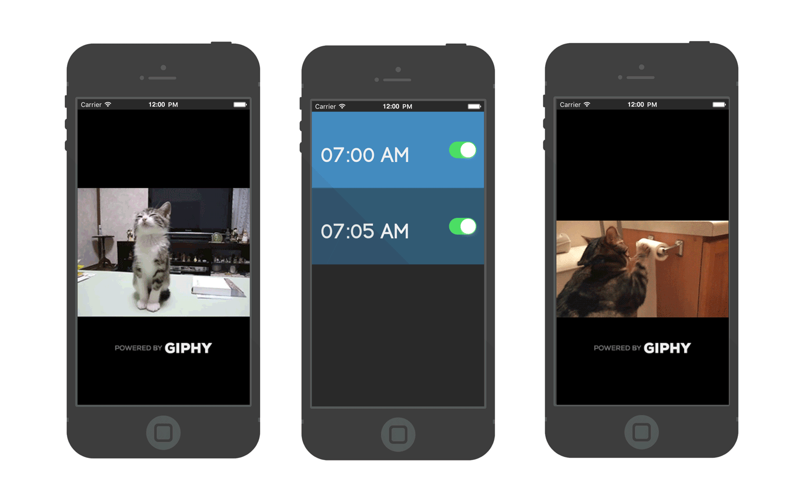

# Gif(phy) Cat Alarm
============



## Overview

Purr-haps the only alarm clock you'll need fur-ever.

Cat O'Clock is iOS alarm clock designed to push alarms notifications to the user with meowing and a cute cat GIF.

## Requirements

Cat O'Clock requires iOS 9.0 or higher.

## Features

- [X] Infinte alarms
- [ ] Save and copy GIFs
- [ ] Special Birthday Alarms
- [X] Cat GIFs powered by Giphy
- [ ] Scroll though GIFs when alarm is presented

## Installation & Usage

To make improvements to this application: 

1. The CocoaPods are already installed. Fork the project and ```open "Cat O'Clock.xcworkspace"```.
2. The NetworkKey header file containing the production API key is intentionally left out, remove the reference.
3. Replace the ```kGiphyApiKey``` with ```kGiphyPublicAPIKey```.

If you add functionality to this application, create an alternative implementation, or build an application that is similar, please contact me and I’ll add a note to the README so that others can find your creation.

## Dependencies

- Powered by Giphy API, and the [Giphy-iOS](https://github.com/heyalexchoi/Giphy-iOS) client for iOS in objective-c
- [Chameleon](https://github.com/ViccAlexander/Chameleon) flat color framework for iOS
- [AFNetworking](https://github.com/AFNetworking/AFNetworking)
- [FLAnimatedImage](https://github.com/Flipboard/FLAnimatedImage) performant animated GIF engine for iOS
